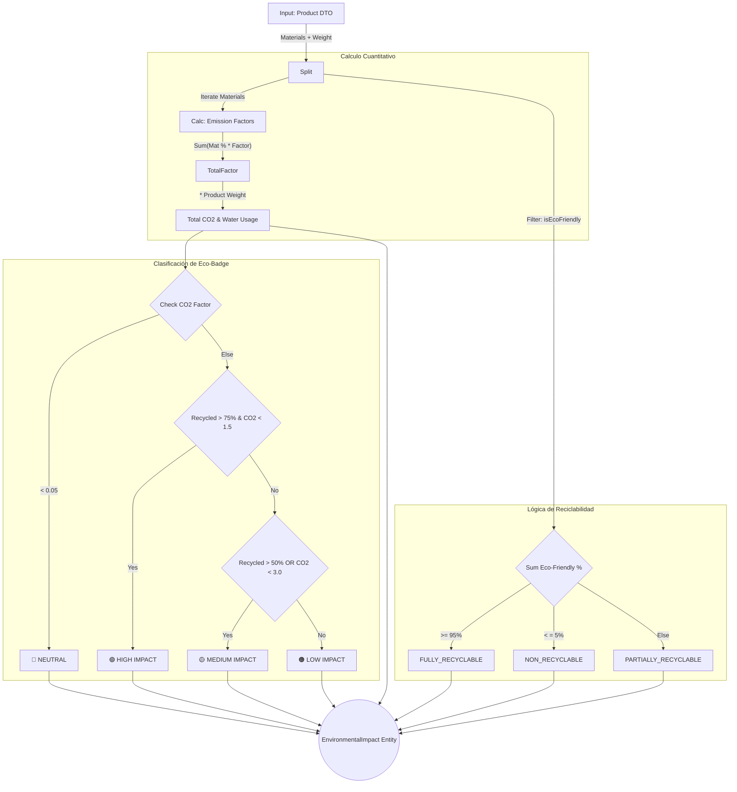
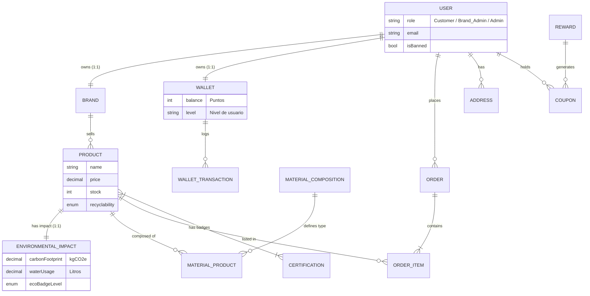

# 🌱 EcoShop Backend API

> **Plataforma de E-commerce Sostenible & Trazabilidad de Impacto**

Backend RESTful desarrollado con **NestJS** para EcoShop, una plataforma que conecta marcas sostenibles con consumidores responsables. Este sistema no solo gestiona transacciones, sino que calcula la huella de carbono de cada producto y recompensa a los usuarios a través de una **Eco-Wallet** gamificada.


## 🚀 Características Principales

Este backend orquesta la lógica de negocio para tres actores principales: **Usuarios (Compradores)**, **Marcas (Vendedores)** y **Administradores**.

- **🛒 Gestión de Catálogo Sostenible:** Productos con desglose de materiales y certificaciones (Fair Trade, Cruelty Free).
- **🌍 Cálculo de Impacto Ambiental:** Algoritmo automático que estima la huella de carbono (CO₂e) y uso de agua basado en el peso y composición del producto.
- **👛 Eco-Wallet (Gamificación):** Sistema de puntos donde las compras sostenibles generan crédito para canjear por descuentos, donaciones o productos.
- **💳 Pasarela de Pagos:** Integración completa con **Stripe** (Checkout Sessions y Webhooks).
- **📊 Dashboard de Marcas:** Métricas de ventas y visualización del impacto positivo generado.
- **🔐 Seguridad:** Autenticación vía JWT y roles de usuario (Guards).

## 🛠️ Stack Tecnológico

* **Core:** NestJS 11, TypeScript.
* **Base de Datos:** MySQL, TypeORM.
* **Pagos:** Stripe API.
* **Imágenes:** Cloudinary (Almacenamiento y optimización).
* **Mailing:** Nodemailer / Handlebars.
* **Documentación:** Swagger (OpenAPI 3.0).

## 📋 Prerrequisitos

Asegúrate de tener instalado:
* [Node.js](https://nodejs.org/) (v18 o superior)
* [MySQL](https://www.mysql.com/) (v8.0 recomendado)
* [NPM](https://www.npmjs.com/)

## ⚙️ Instalación y Configuración

1.  **Clonar el repositorio**
    ```bash
    git clone https://github.com/felipecalderon/nocountry-ecoshop-back.git
    cd ecoshop-back
    ```

2.  **Instalar dependencias**
    ```bash
    npm install
    ```

3.  **Configurar Variables de Entorno**
    Crea un archivo `.env` en la raíz del proyecto. Puedes basarte en el siguiente ejemplo:

    ```ini
    # Servidor
    PORT=3000

    # Base de Datos (MySQL)
    DB_HOST=localhost
    DB_PORT=3306
    DB_USERNAME=tu_usuario
    DB_PASSWORD=tu_contraseña
    DB_NAME=ecoshop_db

    # Autenticación (JWT / Auth0)
    JWT_SECRET=tu_secreto_super_seguro
    
    # Cloudinary (Imágenes)
    CLOUDINARY_CLOUD_NAME=tu_cloud_name
    CLOUDINARY_API_KEY=tu_api_key
    CLOUDINARY_API_SECRET=tu_api_secret

    # Stripe (Pagos)
    STRIPE_SECRET_KEY=sk_test_...
    STRIPE_WEBHOOK_SECRET=whsec_...

    # Nodemailer (Emails)
    MAIL_HOST=smtp.example.com
    MAIL_USER=user@example.com
    MAIL_PASS=password
    ```

4.  **Levantar el servidor en desarrollo**
    ```bash
    npm run start:dev
    ```
    *El servidor iniciará en `http://localhost:3000`*

## 📚 Documentación de la API

Una vez que el servidor esté corriendo, puedes acceder a la documentación interactiva generada con Swagger para probar los endpoints directamente:

📍 **URL:** `http://localhost:3000/api/docs` (o la ruta configurada en `main.ts`)

## 🧪 Testing

El proyecto incluye tests unitarios y e2e configurados con Jest.

```bash
# Correr tests unitarios
npm run test

# Correr test coverage
npm run test:cov
```

## 📡 Respuestas de API

La API utiliza el formato estándar de **JSON** para todas las respuestas. A continuación se muestran ejemplos reales de los flujos principales.

### ✅ Respuesta Exitosa (200 OK - Get Product)
Los objetos incluyen relaciones anidadas calculadas previamente para reducir llamadas adicionales desde el frontend.

```json
{
  "id": "a1b2c3d4-e5f6-7890-1234-56789abcdef0",
  "name": "Remera de Algodón Orgánico",
  "slug": "remera-de-algodon-organico",
  "price": 45.00,
  "stock": 150,
  "environmentalImpact": {
    "carbonFootprint": 2.5,
    "waterUsage": 1200.50,
    "ecoBadgeLevel": "MEDIUM"
  },
  "brand": {
    "name": "Patagonia",
    "slug": "patagonia"
  }
}
```

### ✅ Respuesta de Creación (201 Created - Order)
Al crear una orden, el sistema retorna inmediatamente el ID para seguimiento y el mensaje de confirmación (incluyendo si se aplicaron cupones).

```json
{
  "orderId": "f9e8d7c6-b5a4-3210-9876-54321fedcba0",
  "totalPrice": 135.50,
  "totalCarbonFootprint": 7.5,
  "message": "Orden creada con éxito. Descuento aplicado."
}
```

### ❌ Respuesta de Error (400 Bad Request)
Los errores de validación de negocio (ej: stock insuficiente, validación de materiales) siguen la estructura estándar de excepciones de NestJS.

```json
{
  "statusCode": 400,
  "message": "La suma de los porcentajes de materiales no debe ser mayor al 100%",
  "error": "Bad Request"
}
```

### ❌ Respuesta de Seguridad (401 Unauthorized)
Si un usuario está baneado o el token es inválido.

```json
{
  "statusCode": 401,
  "message": "Este usuario ha sido bloqueado.",
  "error": "Unauthorized"
}
```

## 🧠 Lógica de Negocio y Algoritmos Core

EcoShop implementa reglas de negocio estrictas para garantizar la sostenibilidad, la consistencia de datos y la gamificación. A continuación, se detallan los flujos críticos del sistema.

### 1. Motor de Cálculo Ambiental (Green Algorithm)

El corazón de EcoShop reside en **ProductsService** y **ProductsHelper**. No permitimos valores arbitrarios; cada métrica ambiental se calcula dinámicamente al crear o actualizar un producto.

### A. Fórmula de Huella de Carbono
El cálculo se realiza iterando sobre la composición de materiales del producto. La fórmula matemática implementada es:

$$TotalCO_2 = PesoTotal \times \sum_{i=0}^{n} (Porcentaje_i \times FactorEmision_i)$$

Donde:

- **PesoTotal:** Peso del producto en Kg.

- **Porcentaje:** Fracción del material (ej: 0.8 para 80%).

- **FactorEmision:** Valor base almacenado en MaterialComposition (Kg CO₂e por Kg de material).



#### B. Clasificación de Sostenibilidad (Eco-Badge)
El sistema asigna un nivel (`ecoBadgeLevel`) cruzando dos variables: la **Intensidad de Carbono** y el **Contenido Reciclado**.

| Nivel (Badge) | Criterio Lógico |
| :--- | :--- |
| **🌱 Neutro** | Huella de carbono casi nula (< 0.05). |
| **🟢 Alto (High)** | +75% Material Reciclado **Y** Baja huella de carbono. |
| **🟡 Medio (Medium)** | +50% Material Reciclado **O** Huella moderada. |
| **🟠 Bajo (Low)** | Productos convencionales que no cumplen los criterios anteriores. |

### 2. Ciclo de Vida de la Orden (Transaccionalidad)
El proceso de compra es **Atómico**. Utilizamos QueryRunner para iniciar transacciones de base de datos. Si un solo paso falla (ej: validación de stock o error en cupón), se realiza un **ROLLBACK** completo.

- **Validación de Stock:** Se bloquea el inventario. Si el stock cae por debajo de 5, se dispara un evento stock.alert.
- **Validación de Cupones:** Se verifica validez, expiración y propiedad.
- **Persistencia:** Se genera la orden en estado PENDING.

### 3. Sistema de Gamificación (Eco-Levels)

Para incentivar el consumo responsable, clasificamos a los usuarios según su impacto positivo acumulado (Kg CO₂ evitados en comparación con productos estándar).

* **🥚 Semilla:** < 10 kg CO₂ ahorrados.
* **🌱 Brote Consciente:** ≥ 10 kg CO₂.
* **🌳 Guardián del Bosque:** ≥ 50 kg CO₂.
* **🦸 Héroe Climático:** ≥ 200 kg CO₂.

> **Equivalencia:** El sistema calcula automáticamente que `1 Árbol ≈ 21 kg CO₂` para mostrar métricas comprensibles en el frontend.

### 4. Seguridad (Auth0 & Ban System)

La autenticación sigue un patrón de **Sincronización Diferida** con control de acceso estricto:

* **JWT Strategy:** Valida la firma RS256 del token de Auth0.
* **FindOrCreate:** Sincroniza el usuario en la BD local si es su primer login, trayendo su foto y email.
* **Ban Hammer:** Antes de permitir el acceso, verifica la bandera `isBanned` en la base de datos local. Esto permite a los administradores bloquear el acceso inmediatamente, incluso si el token de Auth0 sigue vigente.

## 📂 Estructura del Proyecto

El proyecto sigue una arquitectura modular donde cada dominio (Productos, Usuarios, Pagos) está encapsulado en su propio módulo.

```bash
nocountry-ecoshop-back/
├── docker-compose.yml        # Orquestación de contenedores (BD + App)
├── package.json              # Dependencias y scripts
├── .env.example              # Variables de entorno de referencia
├── nest-cli.json
├── src/
│   ├── main.ts               # Punto de entrada de la aplicación
│   ├── app.module.ts         # Módulo raíz que importa los sub-módulos
│   ├── swagger.ts            # Configuración de documentación OpenAPI
│   │
│   ├── auth/                 # Autenticación y Seguridad
│   │   ├── decorators/       # @GetUser, @Roles
│   │   ├── guards/           # JwtAuthGuard, RolesGuard
│   │   ├── strategies/       # JwtStrategy
│   │   └── ...
│   │
│   ├── common/               # Utilidades globales
│   │   └── interceptors/     # Logging y Transformación de respuesta
│   │
│   ├── database/             # Configuración de conexión TypeORM
│   │
│   ├── notifications/        # Servicio de Emails (Nodemailer)
│   │   └── templates/        # Plantillas Handlebars (.hbs)
│   │       ├── welcome.hbs
│   │       ├── order-confirmation.hbs
│   │       └── ...
│   │
│   ├── products/             # Módulo Core (Productos)
│   │   ├── dto/              # Validaciones de entrada
│   │   ├── entities/         # Product, EnvironmentalImpact, MaterialProduct
│   │   ├── helpers/          # Lógica auxiliar de productos
│   │   └── ...
│   │
│   ├── orders/               # Gestión de Pedidos
│   │   ├── entities/         # Order, OrderItem
│   │   ├── helper/           # Helpers de notificaciones y cálculo
│   │   └── ...
│   │
│   ├── payments/             # Integración con Pasarela de Pagos
│   │
│   ├── files/                # Carga de imágenes (Cloudinary)
│   │
│   ├── seed/                 # Carga de datos de prueba
│   │
│   ├── material-composition/ # Gestión de materiales base
│   ├── brands/               # Gestión de Marcas
│   ├── certifications/       # Gestión de Sellos/Certificaciones
│   ├── addresses/            # Direcciones de usuarios
│   ├── users/                # Gestión de Usuarios
│   ├── admin/                # Dashboard administrativo
│   └── wallet/               # Lógica de Eco-Wallet (Puntos y Canjes)
│
└── test/                     # Tests E2E y configuración de Jest
```

## 🗂️ Modelo de Datos (ERD)

El siguiente diagrama representa las relaciones principales entre las entidades del sistema, destacando la lógica de negocio entre Usuarios, Marcas, Productos y la Eco-Wallet.



## 📖 Diccionario de Entidades

A continuación, una breve descripción de las entidades principales del sistema:

### 👥 Usuarios y Gestión
- **User:** Actor principal. Puede tener rol de Cliente, Administrador de Marca o Admin Global.
- **Brand:** Perfil de vendedor. Está vinculado 1 a 1 con un Usuario (el dueño de la marca).
- **Address:** Direcciones de envío o facturación vinculadas al usuario.

### 🛒 Catálogo y Sostenibilidad
- **Product:** El artículo en venta. Centraliza la información comercial.
- **EnvironmentalImpact:** Entidad satélite del producto (relación 1:1) que almacena exclusivamente métricas ecológicas (huella de carbono, uso de agua, nivel de "badge").
- **MaterialComposition:** Catálogo maestro de materiales (ej: "Algodón Orgánico", "Poliéster").
- **MaterialProduct:** Tabla intermedia que define **cuánto** de cada material tiene un producto (ej: 80% Algodón, 20% Elastano).
- **Certification:** Sellos o etiquetas (ej: "Cruelty Free") que pueden asignarse a muchos productos.

### 💳 Transacciones (E-commerce)
- **Order:** Cabecera de la compra. Maneja el estado (PENDING, PAID, SHIPPED) y los totales.
- **OrderItem:** Detalle de la compra. Guarda un "snapshot" del precio y del impacto ambiental en el momento exacto de la compra.

### 🎁 Eco-Wallet (Gamificación)
- **Wallet:** Billetera virtual del usuario. Almacena el saldo actual y el nivel (ej: "Semilla", "Árbol").
- **WalletTransaction:** Historial inmutable de movimientos (puntos ganados por compras o gastados en canjes).
- **Reward:** Catálogo de recompensas disponibles (Donaciones, Cupones, Productos).
- **Coupon:** Instancia única de una recompensa canjeada por un usuario.

## 👥 Autores

* **Facundo Ortiz** - *Backend Developer* - [GitHub](https://github.com/AFacundoOrtiz) | [LinkedIn](www.linkedin.com/in/facundo-a-ortiz)
* **Marcos Soria** - *Backend Developer* - [GitHub](https://github.com/Marcos1up) | [LinkedIn](https://www.linkedin.com/in/marcos-soria-dev)
* **Felipe Calderón** - *Frontend Developer* - [GitHub](https://github.com/felipecalderon) | [LinkedIn](https://www.linkedin.com/in/felipecalderone)
* **Emmanuel Cruz** - *Frontend Developer* - [GitHub](https://github.com/emmanuel-cruz-dev) | [LinkedIn](https://www.linkedin.com/in/emmanuel-cruz-dev)
* **Agostina Roggero** - *QA* - [GitHub](#) | [LinkedIn](#)

## 🤝 Contribución
Este proyecto es parte de una simulación de entorno laboral (NoCountry).

Crea un branch para tu feature (git checkout -b feature/nueva-feature).

Haz commit de tus cambios (git commit -m 'Add: nueva feature').

Haz push al branch (git push origin feature/nueva-feature).

Abre un Pull Request.

⌨️ con ❤️ por el equipo de EcoShop